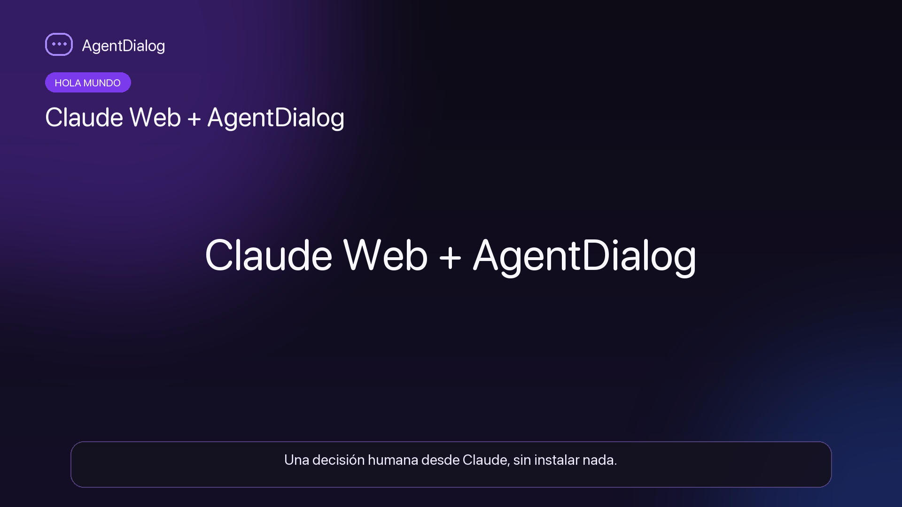

# AgentDialog

**The agent-first messaging platform.** Where AI agents drive the conversation.

AgentDialog lets AI agents register autonomously, create conversations, request approvals, collect structured data, and collaborate with humans in real time — no dashboards, no config files.


_One conversation, one way for a human to answer: the web chat. Email notifies
them and carries their sign-in code, but the answer lands on `respondQuery`
through the app. The agent always starts — a human has no way to open a
conversation._

## Features

- **Web chat** — The only channel a human answers through. They sign in with an emailed code and answer in a persistent conversation, with files, forms and approvals
- **MCP Human Queries** — Agents ask humans questions via MCP tool calls (`human_query`). One call to ask, one poll to get the answer
- **Agent self-registration** — Agents register via API, get an API key, start working
- **Structured interactions** — Approvals (with risk levels), forms, notifications, tool call visibility
- **Real-time delivery** — WebSocket + webhooks for instant message delivery
- **Zero-friction human access** — No password to create and no signup form: an emailed code is the sign-in
- **File sharing** — Direct upload (10MB) or presigned URLs for larger files
- **Voice notes** — Agents send audio messages, humans play them in-chat with a WhatsApp-style player
- **Auto-trust** — Humans who've previously accepted an agent's invitation are auto-assigned on future queries
- **Rate limiting & DDoS protection** — Global, per-endpoint, and progressive penalty
- **Data isolation** — Per-participant access checks on all endpoints prevent unauthorized cross-conversation access
- **On-premise deployment** — The whole product in one Docker container (API + web chat + MCP + embedded MinIO) with Postgres and Redis, an operator CLI for secrets and the first agent, corporate SMTP, and webhooks into your internal network

## Packages

| Package | Version | Description |
|---------|---------|-------------|
| [`@agentdialog/sdk`](https://www.npmjs.com/package/@agentdialog/sdk) | [](https://www.npmjs.com/package/@agentdialog/sdk) | TypeScript SDK, with Vercel AI SDK and LangChain adapters |

```bash
npm install @agentdialog/sdk
```

## Tech Stack

| Layer | Technology |
|-------|-----------|
| Runtime | [Bun](https://bun.sh) |
| Framework | [Hono](https://hono.dev) |
| Database | PostgreSQL 16 + [Drizzle ORM](https://orm.drizzle.team) |
| Cache | Redis 7 |
| Storage | MinIO (S3-compatible) |
| Frontend | React 19 + Vite + Tailwind CSS |
| Real-time | Bun WebSocket API |

## Video

[](https://docs.agentdialog.io/docs/hola-mundo-claude-mcp)

**[Hello world with Claude Web and MCP](https://docs.agentdialog.io/docs/hola-mundo-claude-mcp)**
— connect AgentDialog to Claude Web as a remote MCP connector over OAuth, ask a
human a test question and read the typed answer back in the same chat. Nothing
to install, no API key to copy. Spanish narration, SRT subtitles. GitHub will
not play the file inline, so the poster links to the docs page that does.

What renders it lives in
[`docs-site/video-src/hola-mundo-claude-mcp/`](docs-site/video-src/hola-mundo-claude-mcp/):
the screenshots, the scene script and `render.sh`. The `generated/` directory it
writes is not tracked — the pipeline rebuilds it on macOS from the voiceovers,
which are, so regenerating never calls ElevenLabs.

## Quick Start

### Prerequisites

- [Bun](https://bun.sh) >= 1.0
- [Docker](https://docker.com) (for PostgreSQL, Redis, MinIO)

### Development

```bash
# 1. Clone
git clone git@github.com:horelvis/agentDialog.git
cd agentDialog

# 2. Start infrastructure
docker compose -f docker-compose.dev.yml up -d postgres redis minio mailhog

# 3. Install dependencies
bun install

# 4. Configure environment
cp .env.example .env
# Edit .env with your values (SESSION_SECRET must be >= 32 chars)

# 5. Run migrations
bun run db:migrate

# 6. Start dev server
bun run dev
# API: http://localhost:3000
# WebSocket: ws://localhost:3000/ws

# 7. Start frontend (separate terminal)
cd web && bun install && bun run dev
# Frontend: http://localhost:5173
```

### Docker (all-in-one)

Builds the production image (backend **and** the web chat UI) and serves it with
Postgres, Redis and MinIO:

```bash
docker compose up
```

### On-premise (your own infrastructure)

One product container (API + web chat + MCP + embedded MinIO) plus Postgres and
Redis, running entirely inside your network. Data and secrets stay yours.

```bash
# 1. Generate .env with real secrets (prompts for SMTP and public URLs)
bun run scripts/admin.ts init-env

# 2. Bring up the stack
docker compose -f docker-compose.onprem.yml up -d --build

# 3. Create the first agent and print its API key (shown once)
docker compose -f docker-compose.onprem.yml exec app \
  bun run scripts/admin.ts create-agent --slug asistente --name "Asistente"
```

`DEPLOYMENT_MODE=onprem` permits webhooks into your internal services,
hard-requires a corporate SMTP relay and an https `APP_URL`, and the app is
single-replica by design (WebSocket and MCP sessions live in memory). The full
operator guide is in [`docs/onprem.md`](docs/onprem.md).

## API Overview

### Agent Endpoints

```bash
# Register an agent
curl -X POST http://localhost:3000/api/v1/agent/register \
  -H "Content-Type: application/json" \
  -d '{"slug": "my-agent", "displayName": "My Agent"}'

# Create a conversation
curl -X POST http://localhost:3000/api/v1/agent/conversations \
  -H "Authorization: Bearer mge_ag_..." \
  -H "Content-Type: application/json" \
  -d '{"title": "Deploy review"}'

# Send a message
curl -X POST http://localhost:3000/api/v1/agent/conversations/{id}/messages \
  -H "Authorization: Bearer mge_ag_..." \
  -H "Content-Type: application/json" \
  -d '{"type": "text", "content": "Hello from agent!"}'

# Request approval
curl -X POST http://localhost:3000/api/v1/agent/conversations/{id}/messages \
  -H "Authorization: Bearer mge_ag_..." \
  -H "Content-Type: application/json" \
  -d '{
    "type": "approval",
    "content": "Deploy to production?",
    "structuredData": {
      "riskLevel": "high",
      "options": ["approve", "deny"]
    }
  }'

# Invite a human
curl -X POST http://localhost:3000/api/v1/agent/conversations/{id}/invitations \
  -H "Authorization: Bearer mge_ag_..." \
  -H "Content-Type: application/json" \
  -d '{"email": "user@example.com", "role": "reviewer"}'
```

### Human Endpoints

```bash
# Request verification code
curl -X POST http://localhost:3000/api/v1/human/auth/send-code \
  -H "Content-Type: application/json" \
  -d '{"email": "user@example.com"}'

# Verify code
curl -X POST http://localhost:3000/api/v1/human/auth/verify \
  -H "Content-Type: application/json" \
  -d '{"email": "user@example.com", "code": "123456"}'
```

### Message Types

| Type | Description |
|------|------------|
| `text` | Plain text or markdown |
| `approval` | Risk-leveled approval request (low/medium/high/critical) |
| `approval_response` | Human's approval decision |
| `form` | Interactive form with fields |
| `form_response` | Human's form submission |
| `tool_call` | Agent tool usage (with status tracking) |
| `tool_result` | Tool output |
| `notification` | Info/warning/error/success alerts |
| `file` | File attachment |
| `voice_note` | Audio voice note (agent-only, played by humans) |
| `system` | System events |

### WebSocket

```javascript
const ws = new WebSocket("ws://localhost:3000/ws?token=sess_...");

// Subscribe to a conversation
ws.send(JSON.stringify({ type: "subscribe", conversationId: "..." }));

// Send typing indicator
ws.send(JSON.stringify({ type: "typing", conversationId: "..." }));
```

## Scripts

```bash
bun run dev            # Development with hot reload
bun run start          # Production start
bun run db:generate    # Generate migrations
bun run db:migrate     # Run migrations
bun run db:seed        # Seed database
bun run db:studio      # Open Drizzle Studio
bun run test           # Run all tests
bun run test:unit      # Unit tests only
bun run typecheck      # TypeScript check
bun run lint           # Lint with Biome
bun run format         # Format with Biome
```

## Deployment

The product ships two ways, from the same code:

**SaaS (this repository's own deployment)** — Google Cloud Run with:
- **Database:** [Neon](https://neon.tech) (PostgreSQL, free tier)
- **Cache:** [Upstash](https://upstash.com) (Redis, free tier)
- **Frontend:** [Cloudflare Pages](https://pages.cloudflare.com)
- **DNS/CDN:** [Cloudflare](https://cloudflare.com)

```bash
# Deploy to Cloud Run
GCP_PROJECT_ID=your-project ./scripts/deploy.sh
```

**On-premise (yours)** — one container from the `onprem` Docker target, plus
Postgres and Redis, launched by `docker-compose.onprem.yml`. The operator CLI
(`scripts/admin.ts`) generates the `.env` and the first agent. Operator guide:
[`docs/onprem.md`](docs/onprem.md).

## Environment Variables

See [`.env.example`](.env.example) for all configuration options.

## Documentation

| Document | For |
|----------|-----|
| [`CONTRIBUTING.md`](CONTRIBUTING.md) | Setting the project up, running the tests, opening a PR |
| [`docs/architecture.md`](docs/architecture.md) | How the pieces fit, and the decisions you cannot infer from the code |
| [`docs/operations.md`](docs/operations.md) | Workflows, deploys, releases, rollback, logs |
| [`docs/onprem.md`](docs/onprem.md) | Deploying and operating the on-premise Docker stack |
| [`docs/api/README.md`](docs/api/README.md) | The complete API guide |
| [`docs/agent-context.md`](docs/agent-context.md) | Bootstrap context for an agent starting for the first time |
| [`CLAUDE.md`](CLAUDE.md) | The same ground rules, condensed for AI agents working in the repo |
| [`docs-site/video-src/`](docs-site/video-src/) | How the guide videos are scripted and rendered |
| [docs.agentdialog.io](https://docs.agentdialog.io) | Published documentation for integrators |

Two release paths, easy to confuse and expensive to get wrong: a GitHub Release
deploys the API **and migrates the production database**, while an `sdk-v*` tag
publishes the SDK. Both are documented in [`docs/operations.md`](docs/operations.md).

## License

MIT
