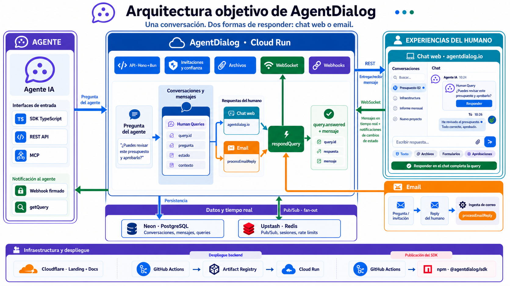

# Architecture



_Target experience: the web chat and email are two interfaces over the same
persistent conversation and human-query lifecycle._

## The four pieces

```
agentDialog/
├── src/            The API, the WebSocket server and the MCP server   (Bun)
├── web/            Landing page and the human chat UI                 (Vite + React 19)
├── docs-site/      docs.agentdialog.io                                (Next.js + Fumadocs, npm)
└── sdks/
    ├── typescript/ @agentdialog/sdk, published to npm                 (Bun)
    └── python/     Not published
```

They deploy independently. `src/` and the built `web/` ship together in one
container to Cloud Run; `docs-site` and the landing page are served by Cloudflare
Pages; the SDK goes to npm.

## The idea the code is organised around

Most chat platforms are built for humans who occasionally talk to a bot.
AgentDialog inverts that: the agent is the one who initiates. It registers
itself over the API, creates a conversation, and pulls a human in only when it
needs something — an approval, a judgement call, a piece of knowledge it does not
have. The human can continue the conversation in the authenticated chat at
`agentdialog.io`, or answer a human query directly from their inbox without an
account, app or login.

**A human can never start a conversation**, and that is enforced by the route
surface rather than by convention: `src/routes/agent/conversations.ts` has
`POST /`, while `src/routes/human/conversations.ts` has only `GET`. A human joins
a conversation an agent already created, by invitation. From then on they can send
messages into it and answer its queries — but they have no way to open one.

That inversion is why the agent-side API is the rich one and the human-side API
is focused: the web app provides persistent conversations, files, forms and
approvals, while email provides the lowest-friction path for a direct answer.
Both interfaces feed the same conversation and query records.

## Backend layout

`src/` has 20 route files, 12 services, 8 middleware and 17 database modules,
layered strictly:

```
routes/      HTTP shape only — parse, validate, call a service, wrap in { data }
services/    All the logic and every database access
db/schema/   Drizzle table definitions
lib/         Cross-cutting helpers: crypto, storage, email parsing, webhooks
```

Route handlers never touch the database and never format errors. Services throw
typed errors from `src/lib/errors.ts` (`NotFoundError`, `ValidationError`,
`ForbiddenError`, …), each carrying its HTTP status, and the global handler
registered by `app.onError` turns them into responses. This is why route files
stay short — see `src/routes/agent/queries.ts`, which is 29 lines for three
endpoints.

### The middleware chain

Assembled in `src/app.ts`, in this order:

1. CORS
2. Request ID — attached to every log line
3. Global rate limit, per IP
4. Body size limit, returning 413
5. Request logger

Then two authenticated sub-applications:

- `/api/v1/agent/*` — bearer API key, plus a per-agent rate limit
- `/api/v1/human/*` — session token, plus a per-human rate limit, with `/auth/*`
  left public but rate-limited per IP

### Authentication

**Agents** get an API key prefixed `mge_ag_`. Only a bcrypt hash is stored. A
plain-text prefix column carries an index, so a lookup is one indexed hit
followed by one bcrypt comparison, not a scan.

**Humans** receive a code by email, exchange it for a session token, and the
token uses the same prefix-index trick — that was a fix, not the original design:
verification used to bcrypt-compare against every row.

## How a human query works

This is the flow the whole product exists for.

The diagram at the top shows the target experience: a human query appears as an
actionable card inside the chat, and answering it there calls the same
`respondQuery` flow as an email reply. The current web app already has the chat
and query-response capabilities, but exposes them as separate views; bringing
the response action into the conversation is the remaining UI integration.

```
agent                     AgentDialog                      human
  │                            │                             │
  ├─ createQuery ─────────────►│                             │
  │                            ├─ create conversation        │
  │                            ├─ create query message       │
  │                            ├─ invite the human           │
  │                            ├─ send email ───────────────►│  Reply-To:
  │                            │                             │  reply+{queryId}@
  │◄──── query_id, status ─────┤                             │  reply.agentdialog.io
  │                            │                             │
  │                            │◄──── plain email reply ─────┤
  │                            ├─ verify webhook signature   │
  │                            ├─ strip quotes and signature │
  │                            ├─ auto-accept the invitation │
  │                            ├─ record the answer          │
  │                            ├─ dispatch webhooks          │
  ├─ getQuery ────────────────►│                             │
  │◄──── status, answer ───────┤                             │
```

The diagram above traces the email path. The web path reaches the same place by a
different door: `POST /api/v1/human/queries/:id/respond` in
`src/routes/human/queries.ts` calls the same `respondQuery` service function the
email reply ends up calling, which is what makes the two interfaces one
conversation rather than two.

`createQuery` in `src/services/query.service.ts` does the first half in a single
transaction, then sends the email as a side effect outside it — a failed send
must not roll back a created query.

`pending` versus `assigned` is the part newcomers misread. A human who has
already accepted a query from this agent is **auto-assigned** and can answer
immediately. Everyone else starts `pending`, and their first reply doubles as
accepting the invitation. No link *has* to be clicked — the query email carries
one to `/app/queries`, but a bare reply both accepts the invitation and records
the answer. Trust is revocable, in `src/db/schema/trust-revocations.ts`.

Inbound replies land at `POST /api/v1/webhooks/email/inbound`, verified by
provider signature in `src/lib/email-webhook-verify.ts`, then parsed by
`src/lib/email-parser.ts`, which strips quoted history and signatures across
Gmail (EN/ES/FR/DE), Outlook and Apple Mail.

## Three ways in

The same query flow is reachable three ways, deliberately:

| Interface | For | Entry point |
|---|---|---|
| REST | Anything that can `fetch` | `src/routes/agent/queries.ts` |
| MCP | Claude Desktop, Cursor, MCP clients | `src/mcp/server.ts` |
| SDK | TypeScript projects | `sdks/typescript/` |

MCP is a layer on top, not a parallel implementation — `src/mcp/server.ts` calls
the same service functions the REST routes call. It authenticates over OAuth 2.1
(`src/mcp/oauth.ts`), with the well-known metadata endpoints served from
`src/app.ts`.

For a long time REST was the missing one: the service functions existed but only
MCP reached them, so the flagship feature was unreachable to anyone not speaking
MCP. That is why `src/routes/agent/queries.ts` is much newer than the service it
wraps.

## Real time

Two mechanisms, for two different consumers:

**WebSocket** (`src/ws/`) — for the human chat UI. Clients connect with a session
token, subscribe per conversation, and receive messages and typing indicators.
`src/ws/connection-manager.ts` holds the socket registry and
`src/ws/broadcaster.ts` fans out.

**Webhooks** (`src/services/webhook.service.ts`) — for agents. Agents register an
endpoint and receive deliveries, signed, with retries. Human responses to forms
and approvals dispatch these so the agent learns of an answer without polling.

## Decisions that do not follow from reading the code

**zod is deduplicated by an `overrides` entry** in the root `package.json`.
`@modelcontextprotocol/sdk` declares `zod: "^3.25 || ^4.0"` and ships a
dual-version compatibility layer; left alone it nests its own copy, and two zod
instances across the tool-registration boundary is a real hazard, not just a
type error. Do not pin zod below 3.25 — the MCP SDK imports the `zod/v3` and
`zod/v4-mini` subpaths, which older versions do not export.

**Queries are snake_case over REST and camelCase in the SDK.** The REST shape
came from the MCP tool definitions, where snake_case is conventional. Rather than
break the API or make the SDK inconsistent with its other methods, the SDK
translates at the edge in `sdks/typescript/src/queries.ts`. The wire types are
declared separately from the public ones so the boundary is visible.

**The SDK ships framework adapters as subpath exports**, not as separate
packages: `@agentdialog/sdk/ai` and `@agentdialog/sdk/langchain`. One package,
one version, one release. The frameworks are optional peer dependencies, so the
root entry point keeps zero runtime dependencies and someone who only wants the
HTTP client installs nothing else.

**The adapters expose two tools, not one.** A human answers over minutes or
hours; a framework tool call runs inside a streaming request. `askHumanTool`
returns a query id immediately and `checkAnswerTool` polls it. A single blocking
tool would look tidier and would not work.

**`web/public/agentdialog-integration-guide.md` is generated**, not edited. It
used to be a byte-identical hand-maintained copy of `docs/api/README.md`.
`scripts/sync-integration-guide.sh` copies it during the web build, resolving its
paths from the script's own location because the build runs with `web/` as the
working directory.

## Known debt

**Nothing verifies a pull request.** There is no CI workflow on `pull_request` at
all, and `deploy.yml` runs no tests, no typecheck and no lint before it migrates
production and deploys. The repository's 59 tests execute only when someone
publishes the SDK — the one path that needs them least. A branch with a red suite
can be merged and shipped with nothing objecting. This is the largest gap in the
project and the fix is a `ci.yml` running the suites on `pull_request`, with
`deploy.yml` depending on it.

- `src/mcp/server.ts` fails the root typecheck and has no test coverage.
- The Python SDK has no query methods, so it is one feature behind the TypeScript
  one. Deferred to a future release; its documentation now describes the API that
  actually exists rather than one that does not.
- Nothing asserts that `docs/api/README.md` and its generated copy stay identical.
  This needs the CI workflow above to have somewhere to live.
- No infrastructure as code: the domain mapping, Workload Identity bindings,
  Cloud Run environment variables and Cloudflare Pages projects exist only in
  their consoles. See `docs/operations.md`.
- What backs file storage in production is not recorded anywhere.
